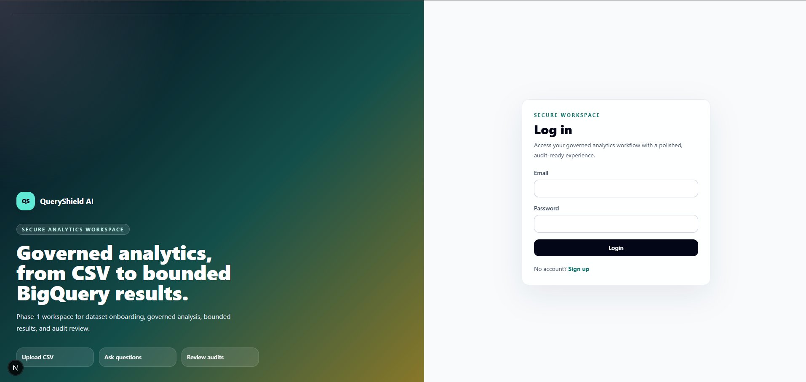
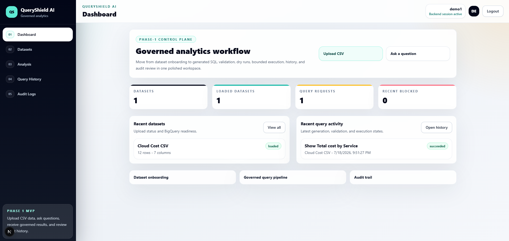
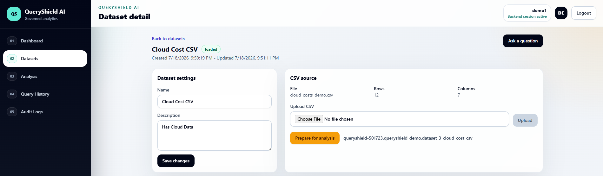
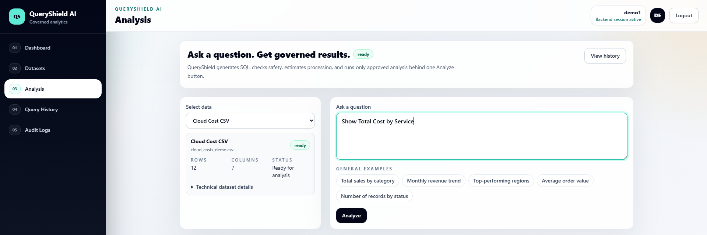
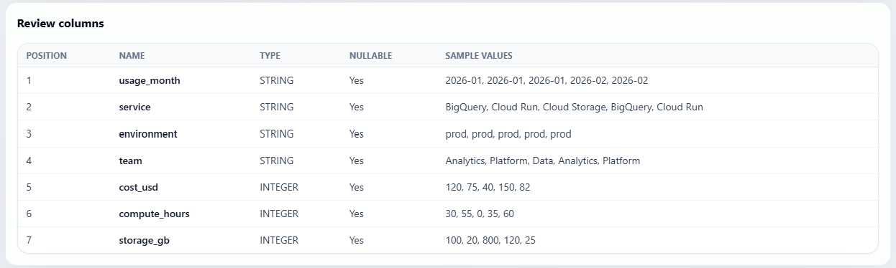
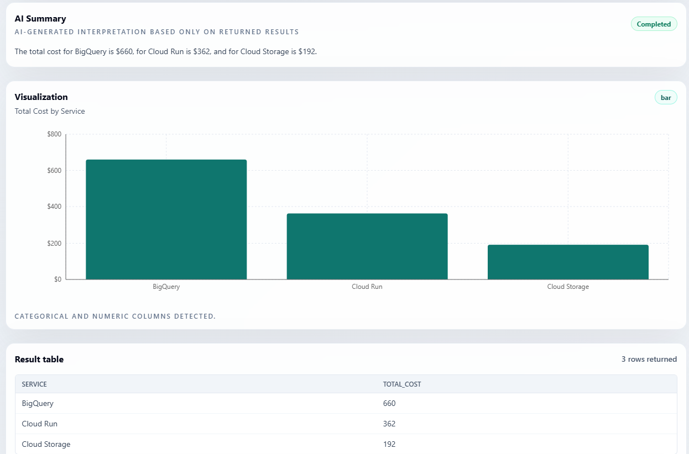
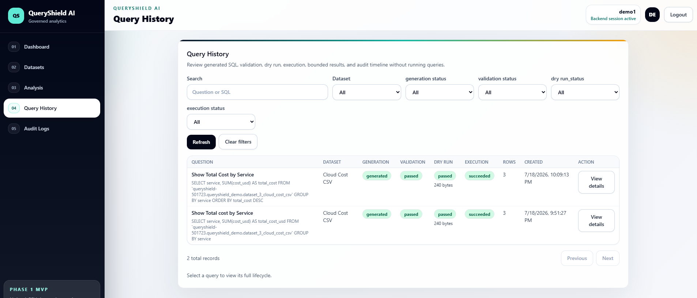
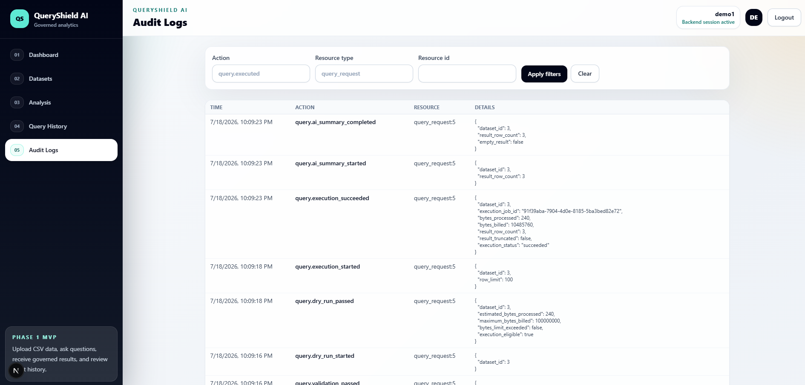
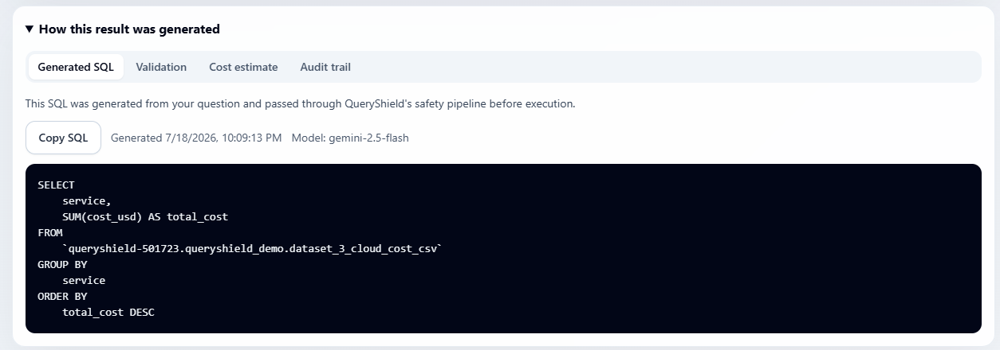
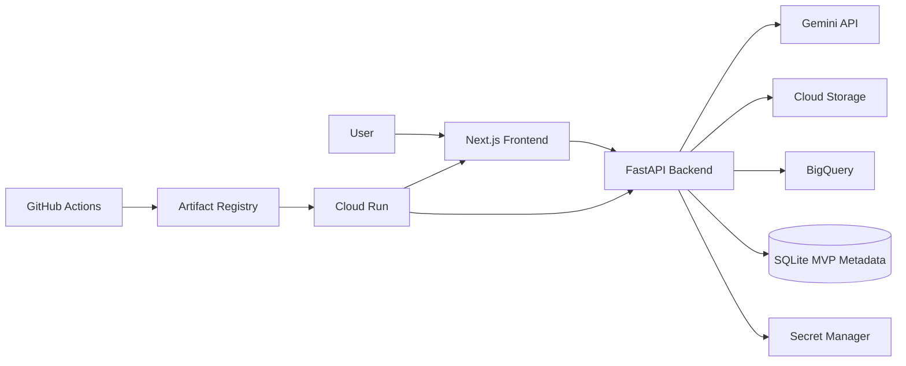

# QueryShield AI

## Overview

QueryShield AI is a governed natural-language-to-SQL analytics platform that lets users upload CSV datasets, ask questions in plain English, and receive safe, cost-controlled analytical results using Gemini and BigQuery.

The application includes Gemini SQL generation, parser-based SQL validation, BigQuery dry runs, configurable cost guardrails, bounded query results, AI summaries, chart visualization, query history, and audit logs.

## Problem

AI-generated SQL is useful, but direct execution can be risky. Queries may be unsafe, incorrect, expensive, or hard to audit.

QueryShield AI addresses common Text-to-SQL risks:

- Unsafe SQL generated by an AI model
- BigQuery cost exposure from large scans
- Lack of auditability around who asked what and what ran
- Non-technical users needing analytics access without direct database access
- Need for validation and governance before execution

## Solution

QueryShield AI adds a governed execution layer between natural-language questions and BigQuery execution.

```text
Natural language question
-> Gemini SQL generation
-> SQL validation
-> BigQuery dry run
-> cost check
-> controlled execution
-> AI summary
-> chart
-> result table
-> history/audit logs
```

The backend is authoritative for authentication, ownership checks, SQL validation, cost controls, execution, summaries, and audit logging.

## Key Features

- User authentication with JWT
- Dataset creation and CSV upload
- Local upload storage for development and Cloud Storage upload support for deployment
- CSV schema detection and preview
- BigQuery table loading
- Gemini-powered natural-language-to-SQL generation
- SQL validation before execution
- Table allowlisting and single-statement read-only enforcement
- BigQuery dry-run bytes and cost estimation
- Configurable query scan limit
- Bounded query results
- AI-generated result summary
- Automatic chart visualization
- Query history
- Audit logs
- Dockerized frontend and backend
- GitHub Actions CI/CD
- Cloud Run deployment

## Demo

Demo video recorded. Public or unlisted link will be added here.

Local demo evidence:

- [Demo walkthrough notes](docs/demo-walkthrough.md)
- `docs/QueryShield_AI_Recording_Video.mp4`

## Screenshots

### Login and Signup



### Dashboard



### Dataset Upload



### Natural-Language Query



### Schema Preview



### AI Summary and Chart



### Query History



### Audit Logs



### SQL Validation



## Architecture

The frontend is built with Next.js and communicates with a FastAPI backend. The backend handles authentication, dataset metadata, CSV upload processing, BigQuery loading, Gemini SQL generation, SQL validation, dry-run estimation, controlled execution, AI result summaries, query history, and audit logging.

- Frontend: Next.js
- Backend: FastAPI
- AI: Gemini
- Analytics: BigQuery
- File storage: Cloud Storage in deployed mode, local disk in development
- Metadata database: SQLite for MVP-1
- Deployment: Cloud Run
- Container registry: Artifact Registry
- Secrets: Secret Manager
- CI/CD: GitHub Actions



More detail:

- [Application architecture](docs/architecture.md)
- [GCP architecture](docs/gcp-architecture.md)
- [GCP MVP-1 deployment guide](docs/gcp-mvp1-deployment.md)

## User Flow

1. Sign up or log in
2. Create a dataset
3. Upload a CSV file
4. Review schema
5. Load data into BigQuery
6. Ask a natural-language question
7. Generate SQL with Gemini
8. Validate SQL safety
9. Run BigQuery dry run
10. Execute controlled query
11. View AI summary, chart, and result table
12. Review query history and audit logs

## Query Governance Pipeline

QueryShield AI does not blindly execute AI-generated SQL.

The governed query pipeline includes:

1. SQL generation using Gemini
2. Parser-based SQL validation with SQLGlot
3. Restricted table access
4. Single-statement read-only enforcement
5. BigQuery dry-run bytes estimation
6. Maximum bytes billed guardrail
7. Controlled execution of stored, approved SQL
8. Bounded result rows
9. Audit log tracking

The result table remains the source of truth. AI summaries and charts are generated only from returned rows.

## GCP Services Used

| Service | Purpose |
|---|---|
| Cloud Run | Runs containerized frontend and backend |
| Artifact Registry | Stores Docker images |
| Cloud Storage | Stores uploaded CSV files |
| BigQuery | Stores analytical tables and executes governed SQL |
| Secret Manager | Stores JWT and Gemini secrets |
| IAM | Controls least-privilege service access |
| Cloud Logging | Captures runtime logs |
| GitHub Actions | Automates CI/CD deployment |

## Tech Stack

### Frontend

- Next.js App Router
- TypeScript
- React
- Tailwind CSS
- Recharts

### Backend

- FastAPI
- Python 3.11
- SQLAlchemy
- Alembic
- SQLite
- Pydantic
- JWT authentication
- pytest

### Cloud / DevOps

- Google Cloud Run
- BigQuery
- Cloud Storage
- Secret Manager
- Artifact Registry
- IAM
- Cloud Logging
- Docker
- Docker Compose
- GitHub Actions
- Workload Identity Federation

### AI and Data Governance

- Gemini via `google-genai`
- SQLGlot
- BigQuery dry runs
- Configurable bytes, timeout, and row-limit guardrails

## Local Development Setup

Prerequisites:

- Python 3.11
- Node.js 20 LTS or newer
- Docker Desktop or Docker Engine for Compose
- Google Cloud project with BigQuery enabled for cloud-backed query flows
- Gemini API key for SQL generation and AI summaries

### Backend

Windows:

```powershell
cd backend
py -3.11 -m venv .venv
.venv\Scripts\activate
python -m pip install -r requirements.txt
Copy-Item .env.example .env
python -m alembic upgrade head
python -m uvicorn app.main:app --reload
```

macOS/Linux:

```bash
cd backend
python3.11 -m venv .venv
source .venv/bin/activate
python -m pip install -r requirements.txt
cp .env.example .env
python -m alembic upgrade head
python -m uvicorn app.main:app --reload
```

Backend API:

- http://127.0.0.1:8000
- http://127.0.0.1:8000/docs
- http://127.0.0.1:8000/redoc

### Frontend

Windows:

```powershell
cd frontend
npm install
Copy-Item .env.example .env.local
npm run dev
```

macOS/Linux:

```bash
cd frontend
npm install
cp .env.example .env.local
npm run dev
```

Frontend app: http://localhost:3000

## Environment Variables

Do not commit real `.env` files, API keys, database passwords, service-account JSON files, local databases, uploaded CSVs, logs, build outputs, or virtual environments.

Safe backend example:

```env
APP_ENV=local
DATABASE_URL=sqlite:///./queryshield.db
JWT_SECRET_KEY=replace-with-strong-secret
GCP_PROJECT_ID=your-gcp-project-id
GCP_REGION=us-central1
BIGQUERY_DATASET_ID=queryshield_demo
GEMINI_API_KEY=your-gemini-api-key
GEMINI_MODEL=gemini-2.5-flash
MAX_BYTES_BILLED=100000000
QUERY_RESULT_ROW_LIMIT=100
QUERY_TIMEOUT_SECONDS=30
STORAGE_BACKEND=local
GCS_UPLOAD_BUCKET=
AI_SUMMARY_ENABLED=true
```

Safe frontend example:

```env
NEXT_PUBLIC_API_BASE_URL=http://127.0.0.1:8000
```

For deployed Cloud Run, secrets are injected from Secret Manager. Local service-account JSON files must not be committed.

## Docker Usage

The frontend and backend are containerized for local validation and Cloud Run deployment.

Build images directly:

```bash
docker build -t queryshield-backend ./backend
docker build -t queryshield-frontend ./frontend
```

Run the local production-style stack:

```bash
docker compose up --build
```

Application URLs:

- Frontend: http://localhost:3000
- Backend: http://localhost:8000
- Swagger UI: http://localhost:8000/docs
- ReDoc: http://localhost:8000/redoc

## CI/CD and Deployment

GitHub Actions CI is defined in `.github/workflows/ci.yml`. It verifies backend dependency installation, linting, formatting, Alembic migrations, backend tests, frontend type checks, chart inference tests, frontend builds, Docker image builds, and Compose configuration.

The deployment workflow is `.github/workflows/deploy-gcp.yml`. It builds Docker images, pushes them to Artifact Registry, and deploys the frontend and backend services to Cloud Run using Workload Identity Federation.

Deployment design:

- No long-lived service-account JSON is stored in GitHub
- Workload Identity Federation is used for keyless deployment
- Artifact Registry stores backend and frontend images
- Cloud Run runs the deployed services
- Secret Manager provides runtime secrets
- Deployment smoke tests verify service health and authentication flow

## Security and Governance

- JWT-based authentication
- Dataset and query ownership checks
- Backend-only Gemini and GCP secrets
- Secrets stored in Secret Manager for deployment
- SQL validation before execution
- Restricted query execution
- BigQuery dry run before execution
- Maximum bytes billed limit
- Query timeout and bounded result rows
- Sanitized error handling
- Audit logs for traceability

## MVP Design Decisions

MVP-1 uses SQLite for lightweight metadata storage, including users, datasets, query history, and audit logs. Uploaded CSV files are stored in Cloud Storage for deployed mode, and analytical tables are loaded into BigQuery.

For production, SQLite would be replaced with Cloud SQL PostgreSQL to support durable, multi-instance metadata storage.

Cloud Run MVP-1 uses `sqlite:////tmp/queryshield.db` for metadata only. This keeps the demo simple and low cost, but the filesystem is ephemeral and should not be used as durable production storage.

## Limitations

- SQLite is used for MVP metadata storage
- Multi-table joins are not included in MVP-1
- Role-based access control is planned but not implemented
- Query summaries are based only on returned rows
- Charts are inferred from bounded query results
- Uploaded demo datasets are small by design
- Cloud Run SQLite metadata can reset after service restarts

## Future Scope

- Replace SQLite with Cloud SQL PostgreSQL
- Add role-based access control
- Support multi-table joins
- Add approval workflow for high-cost queries
- Add saved dashboards and reports
- Add production monitoring and alerting
- Add retention policies for uploaded files and audit logs
- Harden browser sessions with secure HTTP-only cookies

## Resume Highlights

- Built QueryShield AI, a deployed governed Text-to-SQL analytics platform using FastAPI, Next.js, Gemini, BigQuery, Cloud Run, Cloud Storage, and Secret Manager.
- Implemented a 4-stage query governance pipeline with AI SQL generation, parser-based validation, BigQuery dry runs, and controlled execution.
- Automated containerized deployment to Google Cloud Run using Docker, GitHub Actions, Artifact Registry, Workload Identity Federation, IAM service accounts, and Secret Manager.

## License

This project is licensed under the [MIT License](LICENSE).
