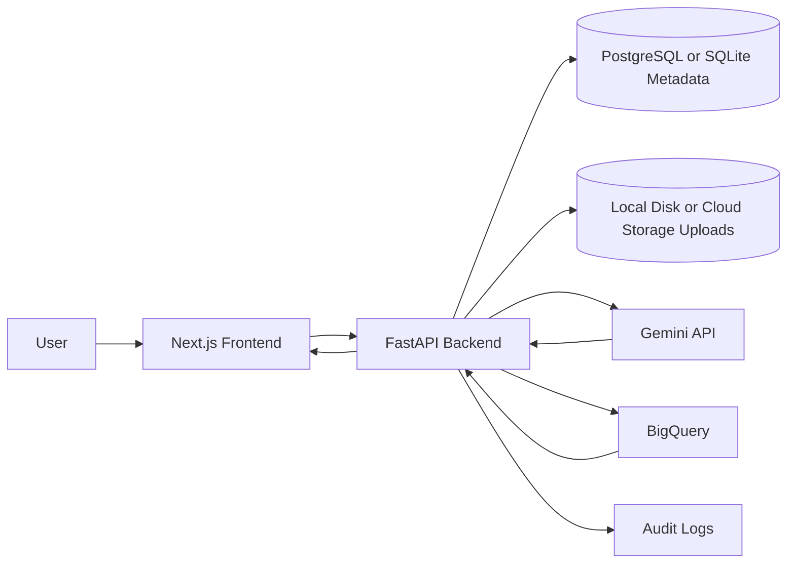

# Architecture

## System Components

- **Frontend**: Next.js App Router application for authentication, dataset workflows, governed query execution, charts, AI summaries, history, and audit views.
- **Backend**: FastAPI API that owns validation, authorization, query governance, cloud calls, persistence, summaries, and audit events.
- **Database**: PostgreSQL for production-like usage; SQLite is available for disposable local development and MVP-1 Cloud Run demo metadata.
- **Object Storage**: Local disk in development or Cloud Storage in deployed GCP mode for uploaded CSV files.
- **Gemini**: Generates BigQuery Standard SQL from a natural-language question and stored dataset schema; optionally summarizes bounded result rows after execution.
- **BigQuery**: Stores loaded CSV datasets and runs dry runs plus controlled execution.

## Main Workflow

```text
CSV upload
-> upload storage
-> schema detection
-> BigQuery load
-> natural-language question
-> SQL generation
-> validation
-> dry run
-> controlled execution
-> bounded result rows
-> chart and optional AI summary
-> history and audit log
```

## Data Flow



## Trust Boundaries

- Browser clients are untrusted.
- Generated SQL is untrusted until it passes backend validation.
- The backend is authoritative for ownership, validation, cost gates, execution, summaries, and audit logging.
- GCP credentials and Gemini API keys remain backend-only.
- BigQuery table access is constrained to the loaded dataset table stored for the user's dataset.
- Charts are derived from already-returned bounded rows and do not trigger additional SQL or AI calls.
- AI summaries are non-authoritative and use only bounded returned rows.

## Execution Controls

- The execution endpoint runs stored generated SQL only.
- The frontend cannot submit arbitrary SQL for execution.
- SQL validation must pass before dry run.
- Dry run must pass before execution.
- Estimated bytes must stay within `MAX_BYTES_BILLED`.
- Execution applies `maximum_bytes_billed` again at BigQuery job time.
- Result rows are capped by `QUERY_RESULT_ROW_LIMIT`.
- Query wait time is capped by `QUERY_TIMEOUT_SECONDS`.
- Query lifecycle and audit events are persisted for review.

## MVP Notes

The MVP stores uploaded CSV files locally in development and in Cloud Storage for GCP deployment. Cloud Run MVP-1 metadata uses SQLite in `/tmp`, which is ephemeral. A durable production deployment should add a managed metadata store, retention rules for uploads, audit logs, query metadata, and stored result rows, plus a hardened session strategy.