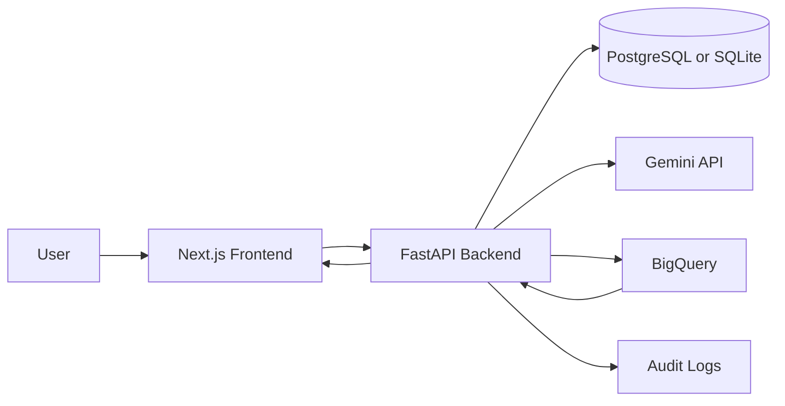

# Architecture

## System Components

- **Frontend**: Next.js App Router application for authentication, dataset workflows, governed query execution, history, and audit views.
- **Backend**: FastAPI API that owns validation, authorization, query governance, cloud calls, persistence, and audit events.
- **Database**: PostgreSQL for production-like usage; SQLite is available for disposable local development.
- **Gemini**: Generates BigQuery Standard SQL from a natural-language question and stored dataset schema.
- **BigQuery**: Stores loaded CSV datasets and runs dry runs plus controlled execution.

## Main Workflow

CSV upload
-> schema detection
-> BigQuery load
-> natural-language question
-> SQL generation
-> validation
-> dry run
-> execution
-> history

## Data Flow

## Trust Boundaries

- Browser clients are untrusted.
- Generated SQL is untrusted until it passes backend validation.
- The backend is authoritative for ownership, validation, cost gates, and execution.
- GCP credentials and Gemini API keys remain backend-only.
- BigQuery table access is constrained to the loaded dataset table stored for the user's dataset.

## Execution Controls

- The execution endpoint runs stored generated SQL only.
- The frontend cannot submit arbitrary SQL for execution.
- SQL validation must pass before dry run.
- Dry run must pass before execution.
- Estimated bytes must stay within `MAX_BYTES_BILLED`.
- Execution applies `maximum_bytes_billed` again at BigQuery job time.
- Result rows are capped by `QUERY_RESULT_ROW_LIMIT`.
- Query wait time is capped by `QUERY_TIMEOUT_SECONDS`.
- Query lifecycle and audit events are persisted for review.

## MVP Notes

The MVP stores uploaded CSV files locally before BigQuery loading and stores bounded execution rows for history review. Production deployment should define retention rules for uploads, audit logs, query metadata, and stored result rows.
