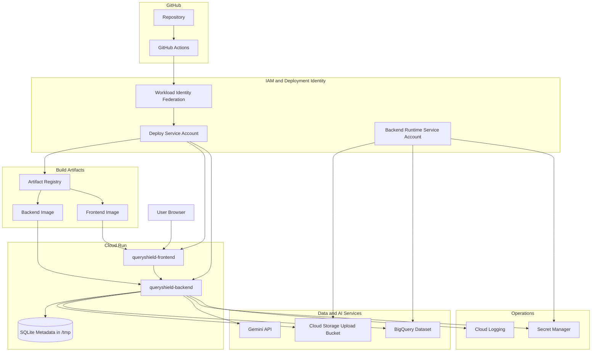
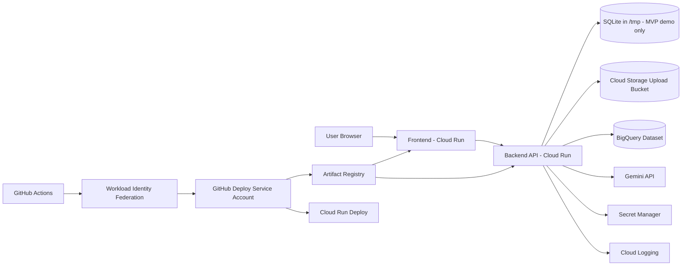

# GCP Architecture

QueryShield AI MVP-1 deploys to GCP as two Cloud Run services with Artifact Registry, BigQuery, Cloud Storage, Secret Manager, IAM service accounts, Cloud Logging, and GitHub Actions Workload Identity Federation.

Cloud SQL is intentionally not used for MVP-1. The backend uses SQLite at `/tmp/queryshield.db` only for demo metadata. That filesystem is ephemeral, so users, audit logs, query history, and dataset metadata can reset after a Cloud Run restart or replacement. The backend is limited to max instances 1 to avoid multiple isolated SQLite files.

## GCP Service Map

This diagram shows the Google Cloud services used by the MVP-1 deployment and what each service is responsible for.

Key ownership rules:

- Cloud Run frontend receives only `NEXT_PUBLIC_API_BASE_URL`.
- Cloud Run backend owns all GCP, Gemini, BigQuery, Cloud Storage, and Secret Manager access.
- GitHub Actions deploys through Workload Identity Federation; no service-account JSON key is committed or required.
- Artifact Registry stores deployable images, not secrets.
- Cloud Storage stores uploaded CSV objects; BigQuery stores analytical tables.
- SQLite in `/tmp` is MVP demo metadata only and can reset after backend restart or replacement.

## Runtime Architecture

## Deployment Flow

```mermaid
flowchart LR
    Dev[Push to GitHub dev or manual dispatch] --> GA[GitHub Actions]
    GA --> Auth[Authenticate with Workload Identity Federation]
    Auth --> Build[Build Docker Images]
    Build --> Push[Push to Artifact Registry]
    Push --> DeployBackend[Deploy Backend to Cloud Run]
    DeployBackend --> BackendURL[Capture Backend URL]
    BackendURL --> BuildFrontend[Build Frontend with API URL]
    BuildFrontend --> DeployFrontend[Deploy Frontend to Cloud Run]
    DeployFrontend --> UpdateCORS[Update Backend CORS]
    UpdateCORS --> Verify[Verify Health Endpoints]
```

## Request Flow

1. The user opens the frontend Cloud Run URL.
2. The frontend calls the backend Cloud Run URL through `NEXT_PUBLIC_API_BASE_URL`.
3. The backend authenticates users with `JWT_SECRET_KEY` from Secret Manager.
4. Uploaded CSV files are stored in the existing private Cloud Storage bucket.
5. The backend loads approved CSV datasets into the existing BigQuery dataset.
6. Gemini generates BigQuery SQL using `GEMINI_API_KEY` from Secret Manager.
7. SQL validation, BigQuery dry run, bytes caps, row limits, and controlled execution remain active.
8. Optional AI summaries are generated from bounded returned rows only.
9. Charts are inferred in the frontend from bounded returned rows only.
10. Logs go to Cloud Logging.

## Boundaries

- Frontend receives only public browser configuration such as `NEXT_PUBLIC_API_BASE_URL`.
- Backend secrets remain in Secret Manager and are exposed only as backend Cloud Run environment variables.
- BigQuery and Cloud Storage use the Cloud Run runtime service account, not local JSON keys.
- The upload bucket is private.
- CORS is updated after frontend deployment to the exact frontend Cloud Run URL.
- No Kubernetes, GKE, Helm, Terraform, Pub/Sub, Cloud Tasks, Memorystore, load balancer, Docker Hub, Cloud SQL, or service-account JSON key is used for MVP-1.